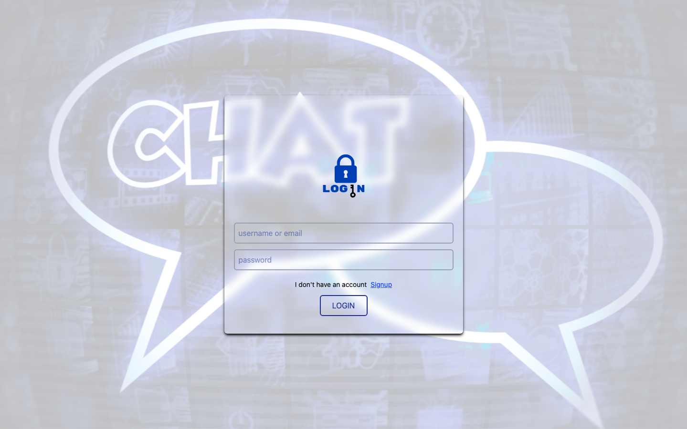
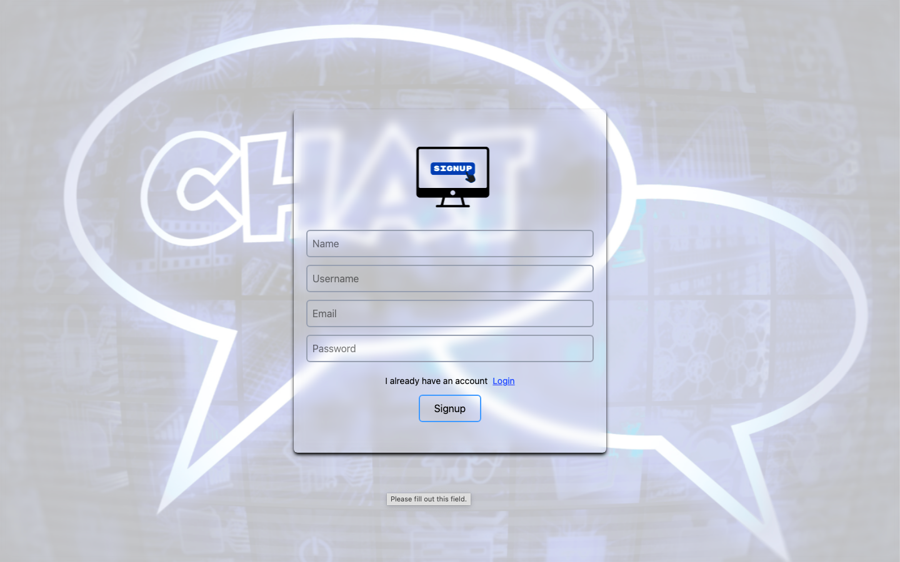
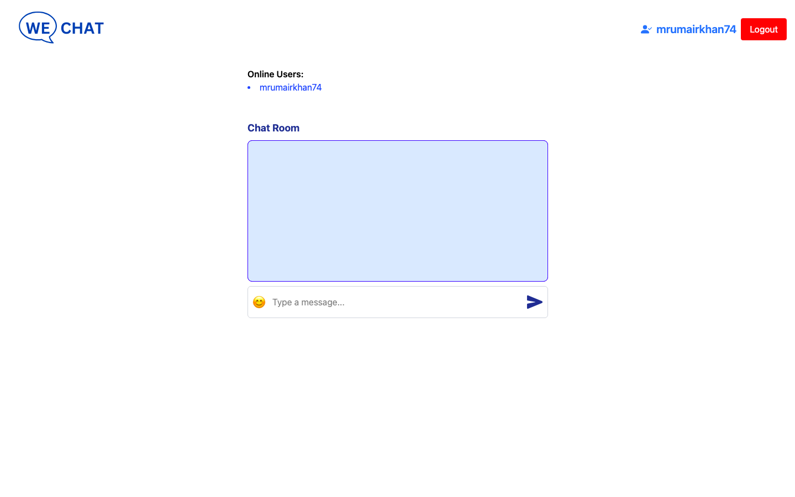
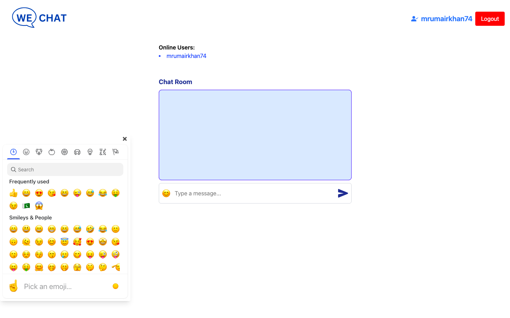

# WeChat-WebApp


<!-- Login Images -->
<h6>Login</h6>

<br>
<h6>Signup</h6>

<br>

<h6>Home</h6>

# 📱 WeChat Web App

A real-time chat web application where users can sign up, log in, and send messages instantly.

---

## 📌 Overview

**WeChat Web App** is a full-stack chat platform built with modern web technologies, providing real-time communication features with a clean and responsive UI.

---

## ⚙️ Tech Stack

- **Frontend:** HTML, CSS, JavaScript (or React)
- **Backend:** Node.js, Express
- **Database:** MongoDB with Mongoose
- **Real-time Communication:** Socket.IO
- **Authentication:** JWT & bcrypt
- **Storage:** MongoDB (Cloud or Local)

---

## 🌟 Features

- 🔐 User Signup & Login
- 💬 Real-Time Messaging
- 🧑‍🤝‍🧑 Chat Interface
- 🕒 Message Timestamps
- 📱 Responsive Design
- 🟢 User Presence Status

---

## 🖼 UI Screenshots

### 🔐 Login


### 📝 Signup


### 🏠 Home (Chat Interface)



---

## 🚀 Installation

### Prerequisites

- Node.js (v14 or higher)
- MongoDB (local or cloud)
- Git

### Steps

```bash
# Clone the repository
git clone https://github.com/yourusername/wechat-webapp.git
cd wechat-webapp

# Install dependencies
npm install

# Set up environment variables
cp .env.example .env
# Edit .env and add MONGO_URI, JWT_SECRET, etc.

# Run the app
npm start
